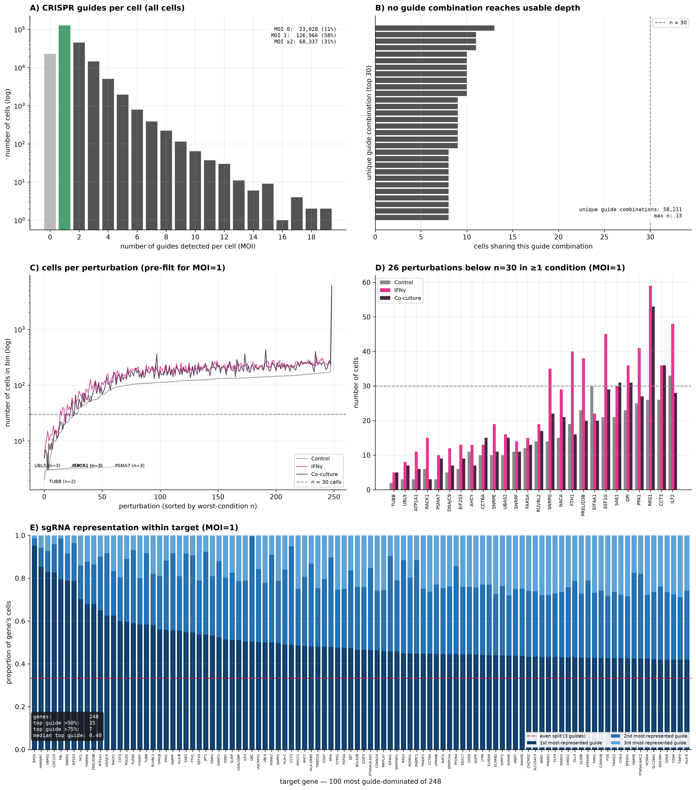
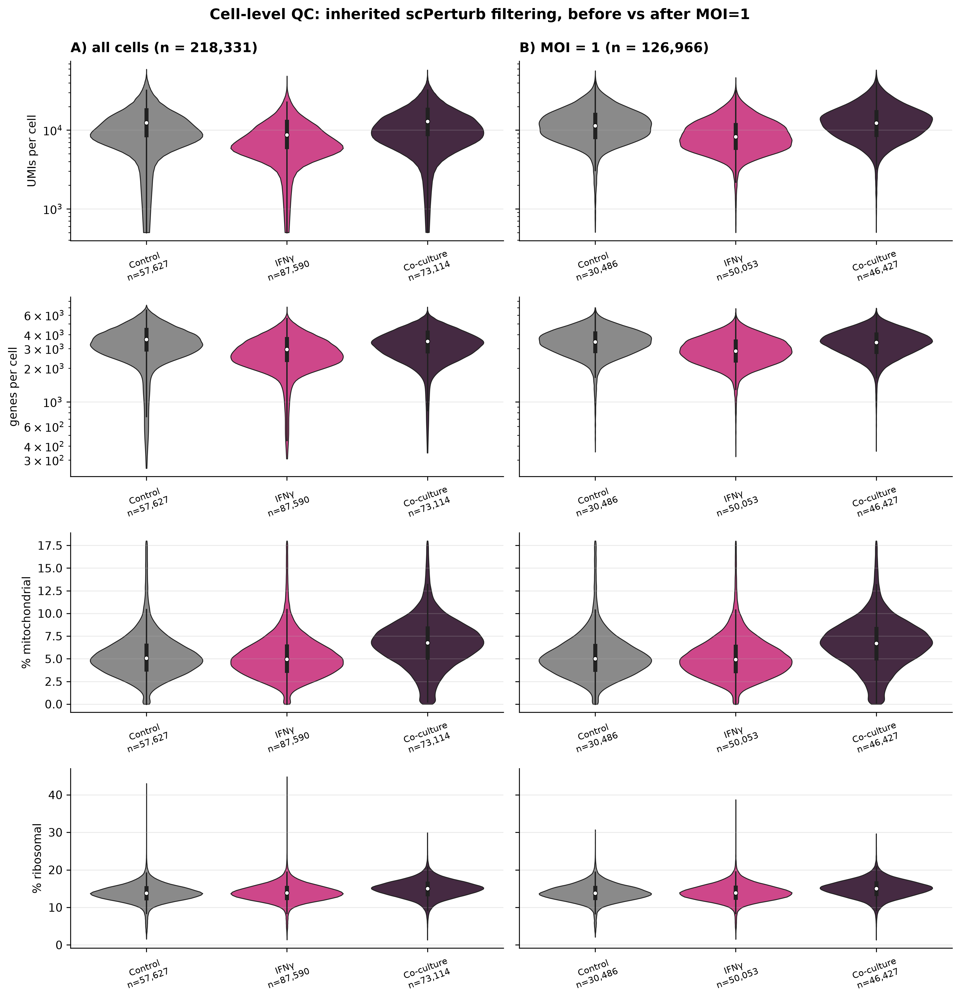
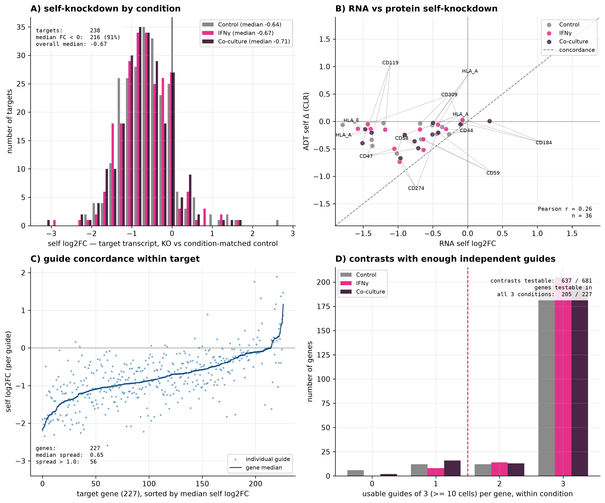
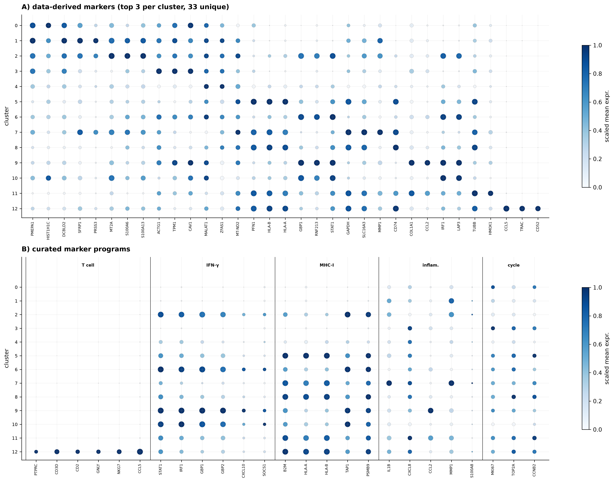

# perturb-cite-seq-frangieh2021-gxe

Reanalysis of **Frangieh et al. 2021** Perturb-CITE-seq on a patient-derived melanoma cell line x stimuli.

> Frangieh CJ, Melms JC, Thakore PI, et al. Multimodal pooled Perturb-CITE-seq
> screens in patient models define mechanisms of cancer immune evasion.
> *Nature Genetics* 53:332–341 (2021). doi:10.1038/s41588-021-00779-1

#### Experimental Design:
- **248 CRISPR-KO targets** immune-checkpoint-resistance / ICR program
   - **~744 targeting guides** (~3 guides/gene)
   - **74 control guides** (37 non-targeting + 37 intergenic)
- **virus, MOI ~0.1** each infected cell receives one guide
- **puromycin selection, transduced cells**
- **3 environmental arms:** Control, IFNg-treated, autologous TIL co-culture
- **readout:** scRNA-seq, 20 ADT panel

#### Processed Dataset:
- **218k cells~** immune-checkpoint-resistance / ICR program

#### Data Exploration:
The interaction of interest is KO target × environment.
How do expression profiles (and ADT signal) differ, from cells targeted by same guide
but in each context: control, IFNg, or TILs (leukocyte attack)

Note that leukocyte attack on cells likely cause big changes in gene expression that will compete with
and interact with the CRISPR-KO

This project is in python using scanpy.  Each AnnData object handles one sparse matrix (and transformations of it).
MuData will hold both the RNA and ADT layers.

## Analysis plan

| Notebook | Question |
|---|---|
| `01_ingest_qc_schema.ipynb` | What is actually in these files, and which perturbation × condition arms have enough cells to say anything? |
| `02_condition_stratified_de.ipynb` | What does each perturbation do, *within* each environment, against condition-matched controls? |
| `03_context_dependence.ipynb` | Which perturbations behave differently across environments — by signature divergence and by E-distance? |
| `04_protein_layer.ipynb` | Do the transcriptional calls survive at the protein level, and where do RNA and ADT disagree? |
| `05_selection_readout.ipynb` | In co-culture, cells are under T-cell selection. Which perturbations are enriched or depleted, and does that agree with the expression readout? |

Full reasoning, including the design traps, is in
[`docs/analysis_plan.md`](docs/analysis_plan.md).

### Currently out of scope

- **Perturbation-response prediction** (GEARS, CPA, scGen).
- Cross-dataset integration with Norman 2019.
- Causal / GRN inference from interventional data.

### Setup

```bash
conda env create -f environment.yml
conda activate frangieh_gxe
python scripts/download_data.py        # ~3-5 GB into data/raw/
jupyter lab
```

Data comes from the [scPerturb](https://scperturb.org) harmonised release
(Zenodo record `10044268`), which applies uniform QC and feature harmonisation
across 44 perturbation datasets. Original deposit is Broad Single Cell Portal
`SCP1064`.

### Configuration

Everything tunable lives in YAML; nothing is hard-coded in notebooks.

- `config/config.yaml` — paths, seed, data URLs, `.obs` schema, QC thresholds,
  DE parameters, E-distance settings, plotting.
- `config/panels.yaml` — ADT↔RNA feature mapping and pathway gene sets.

Notebooks read config via `src/config.py`, which resolves the repo root by
walking up to `config/config.yaml`, so they run from any working directory.

>`nb01` runs `describe_schema()` and `check_schema()` to verify the schema defined in config.yaml against the real files. Needs to be corrected in config if they don't match.  This was done in initial processing, and now corrected in config on Github.

### Known limitations

1. **No biological replicates.** DE uses random pseudo-replicate splits of a
   single sample, which gives the negative-binomial model a variance term but
   systematically understates biological variance. DE p-values are
   anti-conservative — treat the ranking as a ranking. The permutation-tested
   E-distance in `nb03` is the honest effect-size check.
2. **Knockout is incomplete.** CRISPR-Cas9 produces a mixture of frameshift,
   in-frame and unedited alleles. A perturbation with no phenotype may be a
   real negative or an editing failure; guide-level consistency in `nb01` is a
   partial check, not a solution.
3. **Selection confounds the co-culture arm.** Cells surviving T-cell killing
   are a non-random subset. This is a nuisance for the expression analysis and
   the *signal* for `nb05` — the same fact wearing two hats.
4. **One patient-derived line.** Nothing here establishes generality.

### Repository layout

```
config/     YAML configuration (the control surface)
src/        importable helpers: config, io, pseudobulk, stats, plotting
notebooks/  01-05, run in order
scripts/    download_data.py
data/       raw / interim / processed  (gitignored)
results/    figures / tables           (gitignored)
docs/       analysis_plan.md
```

### License

MIT (code). The underlying data is redistributed by scPerturb under CC-BY;
cite Frangieh et al. 2021 and Peidli et al. 2024 for any reuse.


## Part I: data exploration and QC
schema of .h5ad processed data was explored, naming of columns etc adjusted in config.yaml and panels.yaml
A power table was constructed to look at number of pseudoreplicates (cells) per {perturbation1 x perturbation2} condition

### Figure 1 — Screen design and cell filtering



**(A)** MOI distribution: number of guides detected per cell across all 218k cells.
Although the screen was designed for low multiplicity, only 58% of cells carry exactly one guide;
31% carry two or more (up to 19), and 11% have no guide captured (which may be seq depth issue or no guide delivery - they survived puro).
**(B)** For cells receiving more than one guide: no {perturbation1 x perturbation2} has enough cells to proceed with.
Gene1 x gene2 comparisons are not feasible in this experimental design.
**(C)** dataset filtered for cells with MOI=1 (1 guide received). Sufficient power is defined as ~30 cells within
{perturbation1 x perturbation2} bin.
**(D)** cell counts for perturbations where n<=30 cells in at least one {perturbation2}.
**(E)** sgRNA representation within each target {perturbation1}: for a given target, are there multiple guides represented in the data?

Panels A and B describe all cells (218k), since they motivate the filter; C–E describe
the 126k single-guide cells retained for downstream analysis.

#### Figure 1 conclusions:

Wet lab experimental design caveat: 42% of cells captured are filtered out (MOI not equal to 1; insufficient cell number to do gene x gene comparisons)

sgRNA representation within-target is a small issue, over all.  Though a few targets are dominated by just one sgRNA.

### Figure 2 — Cell-level quality control



UMI count, gene count, and mitochondrial and ribosomal fractions, split by
condition, before **(A)** and after **(B)** restricting to single-guide cells.
White points mark medians; group sizes are given beneath each violin. UMI and
gene counts are on log scales.

QC cutoffs (i.e. pct.mito < ~20) determined by scPerturb "harmonised" release.
These filters can be treated as quality-neutral, since they look the same before and after filtering for single-guide cells.

#### Figure 2 conclusions:
No further QC filtering on single-guide-cells dataset is warranted at thsi point.
We **do** expect to see differences in "QC metrics" like pct.mito when we get to comparing TILs to control - the cells are under attach and dying.
This will need to be handled with biology in mind, conducting analysis downstream.

## Part II — Validating CRISPR-KO perturbation
looking at self-RNA and ADT signals - establish that CRISPR-KO worked.
Mechanism: Cas9 cut (random) causes FS, NMD, lower transcript level.

With 248 CRISPR-KO targets, it could be useful to remove some from analysis (if they didn't achieve sufficient transcript KD) - this would lessen the harshness of multiple comparison testing, but depending how many are removed, this may not have a big impact statistically.

### Figure 3 — Perturbation QC



**(A)** Self L2FC — simple pseudobulk ratio. Within perturbation_2 condition, by CRISPR-KO target: sum raw cts for KO cells, then cpm. Sum raw cts for ctrl guide cells, then cpm.  simple pseudobulk L2F = log2((CPM_KO + 1) / (CPM_control + 1))

Distribution is shifted negative in all three perturbation_2 conditions; expected for efficacious editing that preceded perturbation_2.

**(B)** RNA vs protein self-knockdown for the 12 targets whose product is in
the ADT panel.

Note insidious caveats e.g. the HLA_A antibody is clone W6/32; a conformational
pan-MHC-I epitope requiring β2-microglobulin - no specific for HLA-A!  KO HLA-A still permits antibody detecting other two HLA's: partial loss of signal predicted, assuming no upreg of other HLA in response to CRISPR-KO against HLA-A.

Absence of knockdown is ambiguous under Cas9. In-frame
indels preserve the transcript, unedited alleles contribute normal message, and
genes with a premature stop near the 3′ end escape NMD entirely. A target with
no transcript loss may still be protein-null.

**(C)** Guide concordance (n=3 per CRISPR-KO target).  Per CRISPR-KO target, L2FC was computed between sgRNA, 2, or 3 vs "control guides" (pooled).  Same simple L2FC calculation as in (A).  The line is the median for L2FC for each of the 3 guides; points are individual guides.

Guide spread > 1.0 (n=48) = 2-fold difference between most and least effective guide.  Some variance in how many cells assigned to each guide (see fig. 1E, though not subsetted by perturbation_2 there).  Since Spearman correlation is low (ρ = 0.06) between # cells and guide spread, this variation is coming from KO efficiency, not a power
artifact. These n=48 genes are flagged rather than removed - other signatures could make these worth considering even though by this measure they are not ideal in the dataset.

**(D)** Rough assessment of statistical power, vis-a-vis sgRNA "n". setting min cells = 10, how many CRISPR-KO targets have at least 2 guides represented (first grouped by perturbation_2)

## Part III: clustering, UMAP, rationale vis-a-vis experimental design
This dataset is from one cell type: melanoma.  The main predicted axis of variation is perturbation2.  There is also likely to be strong enough signal from cell cycle, and possibly from CRISPR KO of a very key regulatory gene that changes GEX enough to sway clustering (though I think this is less powerful than the first two)

UMAP will be nice, as it helps visualize the changes in GEX induced by perturbation2.  From there, one can overlay other metrics (i.e. pct.ribo), and interpret them with caveats in mind.

Scope:
1. normalize data, HVG on control guide cells only (perturbation_2 dominates the variance, we want to remove CRISPR effect from clustering which will be measured later).  PCA, neighbors, UMAP
2. UMAP colored by perturbation2 - predict visible separation on UMAP1 and/or 2.
3. overlay QC metrics: seq depth, mito, ribo.  Any region driven by these?
4. cell cyle sorting (scanpy fxn) - overlay on UMAP
5. T-cell contamination? Dataset is filtered for MOI=1, but droplets with T cells could have ambient guide RNA or doublet with a melanoma cell with a guide

### Figure 4 — Embedding


**(A)** Leiden clusters, resolution 0.3 - judged from the UMAP (visual estimate of number of clusters desired), returns 13 clusters. **(B)** UMAP colored by perturbation_2 (ctrl, IFNg, TIL co-culture) - the 3 macro clusters follow experimental design. **(C)** The 12 CRISPR perturbations whose cells are
most unevenly distributed across subclusters within their own perturbation_2 condition.

12 of 13 clusters are ≥89% a single perturbation_2 condition. No CRISPR knockout was strong enough to drive a cluster of its own.  In Norman et al. 2019 CRISPRa on K562 cells, overexpression of KLF drove a cluster strongly (master regulator TF)

### Figure 5 — Cluster identity



**(A)** Top 3 markers per cluster, ranked from the data. **(B)** Curated
marker programs - cluster 12 (557 cells, all from perturbation_2==TIL) is cells with T cell transcripts (probably doublets). 

### Figure 6 — QC and cell-cycle overlays


Standard QC metrics, overlaid on UMAP.  Sequencing depth, gene count, mitochondrial and ribosomal fraction, and cell-cycle phase. Colour ranges are clipped to the 1st–99th
percentile and points drawn in ascending order so sparse extremes remain
visible.

In nb01 violins, differences in QC metrics were not striking between the 3 "macro clusters" of perturbation_2.  Thought there was elevated pct.mito in TIL co-culture, as cells are undergoing apoptosis.  Here, there may be a bit more granularity to appreciate in sub-clusters - e.g. pct.ribo seems to roughly mirror cell cycle phase.
