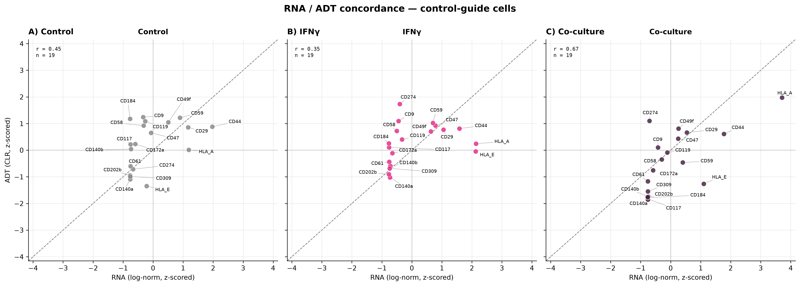
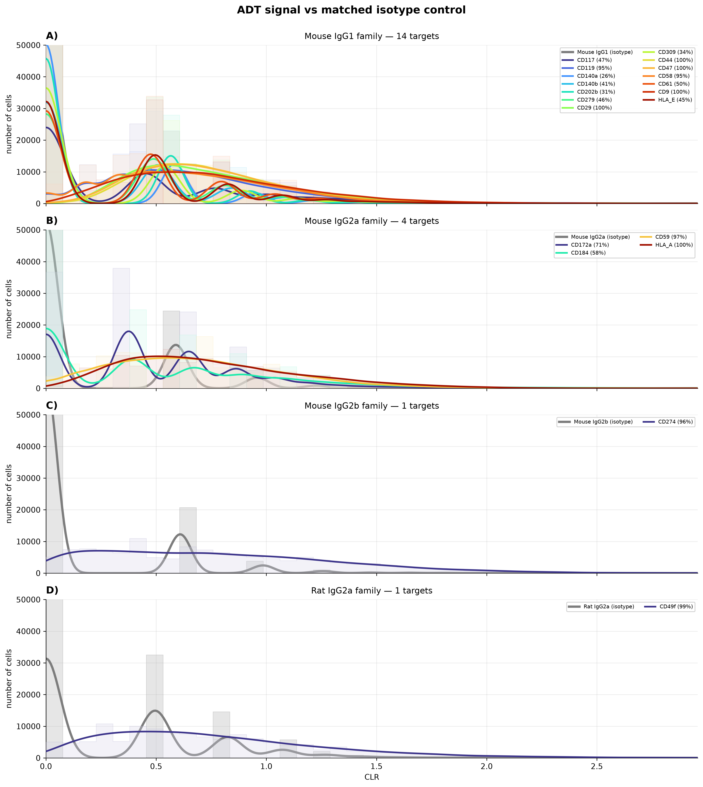
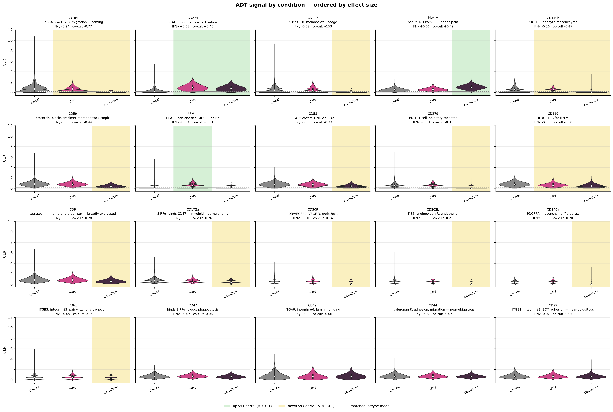
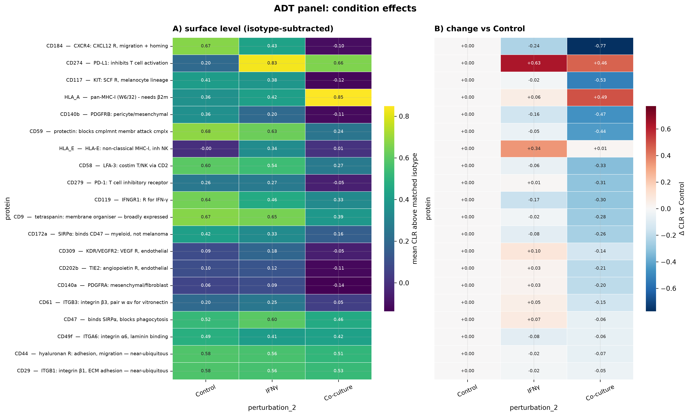
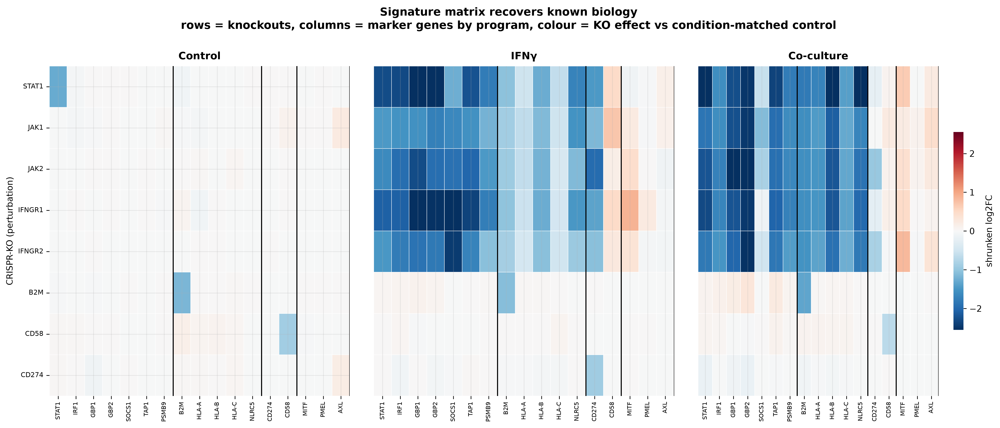
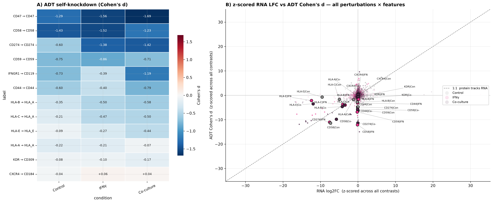
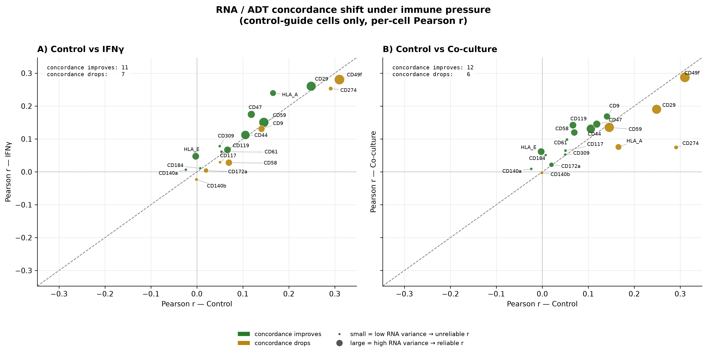
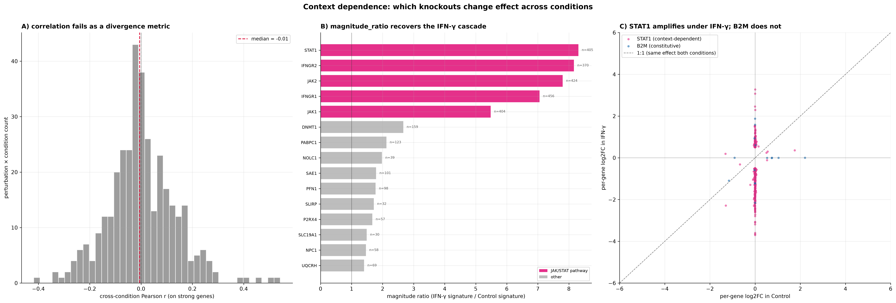

# perturb-cite-seq-frangieh2021-gxe

Reanalysis of **Frangieh et al. 2021** Perturb-CITE-seq on a patient-derived melanoma cell line x stimuli.

> Frangieh CJ, Melms JC, Thakore PI, et al. Multimodal pooled Perturb-CITE-seq
> screens in patient models define mechanisms of cancer immune evasion.
> *Nature Genetics* 53:332–341 (2021). doi:10.1038/s41588-021-00779-1

#### Experimental Design:
- **248 CRISPR-KO targets** immune-checkpoint-resistance / ICR program
   - **~744 targeting guides** (~3 guides/gene)
   - **74 control guides** (37 non-targeting + 37 intergenic)
- **virus, MOI ~0.1** each infected cell receives one guide
- **puromycin selection, transduced cells**
- **3 environmental arms:** Control, IFNg-treated, autologous TIL co-culture
- **readout:** scRNA-seq, 20 ADT panel

#### Processed Dataset:
- **218k cells~** immune-checkpoint-resistance / ICR program

#### Data Exploration:
The interaction of interest is KO target × environment.
How do expression profiles (and ADT signal) differ, from cells targeted by same guide
but in each context: control, IFNg, or TILs (leukocyte attack)

Note that leukocyte attack on cells likely cause big changes in gene expression that will compete with
and interact with the CRISPR-KO

This project is in python using scanpy.  Each AnnData object handles one sparse matrix (and transformations of it).
MuData will hold both the RNA and ADT layers.

## Analysis plan

| Notebook | Question |
|---|---|
| `01_ingest_qc_schema.ipynb` | What is actually in these files, and which perturbation × condition arms have enough cells to say anything? |
| `02_condition_stratified_de.ipynb` | What does each perturbation do, *within* each environment, against condition-matched controls? |
| `03_context_dependence.ipynb` | Which perturbations behave differently across environments — by signature divergence and by E-distance? |
| `04_protein_layer.ipynb` | Do the transcriptional calls survive at the protein level, and where do RNA and ADT disagree? |
| `05_selection_readout.ipynb` | In co-culture, cells are under T-cell selection. Which perturbations are enriched or depleted, and does that agree with the expression readout? |

Full reasoning, including the design traps, is in
[`docs/analysis_plan.md`](docs/analysis_plan.md).

### Currently out of scope

- **Perturbation-response prediction** (GEARS, CPA, scGen).
- Cross-dataset integration with Norman 2019.
- Causal / GRN inference from interventional data.

### Setup

```bash
conda env create -f environment.yml
conda activate frangieh_gxe
python scripts/download_data.py        # ~3-5 GB into data/raw/
jupyter lab
```

Data comes from the [scPerturb](https://scperturb.org) harmonised release
(Zenodo record `10044268`), which applies uniform QC and feature harmonisation
across 44 perturbation datasets. Original deposit is Broad Single Cell Portal
`SCP1064`.

### Configuration

Everything tunable lives in YAML; nothing is hard-coded in notebooks.

- `config/config.yaml` — paths, seed, data URLs, `.obs` schema, QC thresholds,
  DE parameters, E-distance settings, plotting.
- `config/panels.yaml` — ADT↔RNA feature mapping and pathway gene sets.

Notebooks read config via `src/config.py`, which resolves the repo root by
walking up to `config/config.yaml`, so they run from any working directory.

>`nb01` runs `describe_schema()` and `check_schema()` to verify the schema defined in config.yaml against the real files. Needs to be corrected in config if they don't match.  This was done in initial processing, and now corrected in config on Github.

### Known limitations

1. **No biological replicates.** DE uses random pseudo-replicate splits of a
   single sample, which gives the negative-binomial model a variance term but
   systematically understates biological variance. DE p-values are
   anti-conservative — treat the ranking as a ranking. The permutation-tested
   E-distance in `nb03` is the honest effect-size check.
2. **Knockout is incomplete.** CRISPR-Cas9 produces a mixture of frameshift,
   in-frame and unedited alleles. A perturbation with no phenotype may be a
   real negative or an editing failure; guide-level consistency in `nb01` is a
   partial check, not a solution.
3. **Selection confounds the co-culture arm.** Cells surviving T-cell killing
   are a non-random subset. This is a nuisance for the expression analysis and
   the *signal* for `nb05` — the same fact wearing two hats.
4. **One patient-derived line.** Nothing here establishes generality.

### Repository layout

```
config/     YAML configuration (the control surface)
src/        importable helpers: config, io, pseudobulk, stats, plotting
notebooks/  01-05, run in order
scripts/    download_data.py
data/       raw / interim / processed  (gitignored)
results/    figures / tables           (gitignored)
docs/       analysis_plan.md
```

### License

MIT (code). The underlying data is redistributed by scPerturb under CC-BY;
cite Frangieh et al. 2021 and Peidli et al. 2024 for any reuse.


## Part I: data exploration and QC
schema of .h5ad processed data was explored, naming of columns etc adjusted in config.yaml and panels.yaml
A power table was constructed to look at number of pseudoreplicates (cells) per {perturbation1 x perturbation2} condition

### Figure 1 — Screen design and cell filtering


**(A)** MOI distribution: number of guides detected per cell across all 218k cells.
Although the screen was designed for low multiplicity, only 58% of cells carry exactly one guide;
31% carry two or more (up to 19), and 11% have no guide captured (which may be seq depth issue or no guide delivery - they survived puro).
**(B)** For cells receiving more than one guide: no {perturbation1 x perturbation2} has enough cells to proceed with.
Gene1 x gene2 comparisons are not feasible in this experimental design.
**(C)** dataset filtered for cells with MOI=1 (1 guide received). Sufficient power is defined as ~30 cells within
{perturbation1 x perturbation2} bin.
**(D)** cell counts for perturbations where n<=30 cells in at least one {perturbation2}.
**(E)** sgRNA representation within each target {perturbation1}: for a given target, are there multiple guides represented in the data?

Panels A and B describe all cells (218k), since they motivate the filter; C–E describe
the 126k single-guide cells retained for downstream analysis.

#### Figure 1 conclusions:

Wet lab experimental design caveat: 42% of cells captured are filtered out (MOI not equal to 1; insufficient cell number to do gene x gene comparisons)

sgRNA representation within-target is a small issue, over all.  Though a few targets are dominated by just one sgRNA.

### Figure 2 — Cell-level quality control


UMI count, gene count, and mitochondrial and ribosomal fractions, split by
condition, before **(A)** and after **(B)** restricting to single-guide cells.
White points mark medians; group sizes are given beneath each violin. UMI and
gene counts are on log scales.

QC cutoffs (i.e. pct.mito < ~20) determined by scPerturb "harmonised" release.
These filters can be treated as quality-neutral, since they look the same before and after filtering for single-guide cells.

#### Figure 2 conclusions:
No further QC filtering on single-guide-cells dataset is warranted at thsi point.
We **do** expect to see differences in "QC metrics" like pct.mito when we get to comparing TILs to control - the cells are under attach and dying.
This will need to be handled with biology in mind, conducting analysis downstream.

## Part II — Validating CRISPR-KO perturbation
looking at self-RNA and ADT signals - establish that CRISPR-KO worked.
Mechanism: Cas9 cut (random) causes FS, NMD, lower transcript level.

With 248 CRISPR-KO targets, it could be useful to remove some from analysis (if they didn't achieve sufficient transcript KD) - this would lessen the harshness of multiple comparison testing, but depending how many are removed, this may not have a big impact statistically.

### Figure 3 — Perturbation QC


**(A)** Self L2FC — simple pseudobulk ratio. Within perturbation_2 condition, by CRISPR-KO target: sum raw cts for KO cells, then cpm. Sum raw cts for ctrl guide cells, then cpm.  simple pseudobulk L2F = log2((CPM_KO + 1) / (CPM_control + 1))

Distribution is shifted negative in all three perturbation_2 conditions; expected for efficacious editing that preceded perturbation_2.

**(B)** RNA vs protein self-knockdown for the 12 targets whose product is in
the ADT panel.

Note insidious caveats e.g. the HLA_A antibody is clone W6/32; a conformational
pan-MHC-I epitope requiring β2-microglobulin - no specific for HLA-A!  KO HLA-A still permits antibody detecting other two HLA's: partial loss of signal predicted, assuming no upreg of other HLA in response to CRISPR-KO against HLA-A.

Absence of knockdown is ambiguous under Cas9. In-frame
indels preserve the transcript, unedited alleles contribute normal message, and
genes with a premature stop near the 3′ end escape NMD entirely. A target with
no transcript loss may still be protein-null.

**(C)** Guide concordance (n=3 per CRISPR-KO target).  Per CRISPR-KO target, L2FC was computed between sgRNA, 2, or 3 vs "control guides" (pooled).  Same simple L2FC calculation as in (A).  The line is the median for L2FC for each of the 3 guides; points are individual guides.

Guide spread > 1.0 (n=48) = 2-fold difference between most and least effective guide.  Some variance in how many cells assigned to each guide (see fig. 1E, though not subsetted by perturbation_2 there).  Since Spearman correlation is low (ρ = 0.06) between # cells and guide spread, this variation is coming from KO efficiency, not a power
artifact. These n=48 genes are flagged rather than removed - other signatures could make these worth considering even though by this measure they are not ideal in the dataset.

**(D)** Rough assessment of statistical power, vis-a-vis sgRNA "n". setting min cells = 10, how many CRISPR-KO targets have at least 2 guides represented (first grouped by perturbation_2)

### Figure 4 — RN vs ADT concordance



Using control guide cells only, subsetted by culture condition.  RNA and ADT signal were z-scored and plotted against each other. Mostly good concordance, with some disconnect between protein and RNA levels.

## Part III: clustering, UMAP, rationale vis-a-vis experimental design
This dataset is from one cell type: melanoma.  The main predicted axis of variation is perturbation2.  There is also likely to be strong enough signal from cell cycle, and possibly from CRISPR KO of a very key regulatory gene that changes GEX enough to sway clustering (though I think this is less powerful than the first two)

UMAP will be nice, as it helps visualize the changes in GEX induced by perturbation2.  From there, one can overlay other metrics (i.e. pct.ribo), and interpret them with caveats in mind.

Scope:
1. normalize data, HVG on control guide cells only (perturbation_2 dominates the variance, we want to remove CRISPR effect from clustering which will be measured later).  PCA, neighbors, UMAP
2. UMAP colored by perturbation2 - predict visible separation on UMAP1 and/or 2.
3. overlay QC metrics: seq depth, mito, ribo.  Any region driven by these?
4. cell cyle sorting (scanpy fxn) - overlay on UMAP
5. T-cell contamination? Dataset is filtered for MOI=1, but droplets with T cells could have ambient guide RNA or doublet with a melanoma cell with a guide

### Figure 5 — Embedding


**(A)** Leiden clusters, resolution 0.3 - judged from the UMAP (visual estimate of number of clusters desired), returns 13 clusters. **(B)** UMAP colored by perturbation_2 (ctrl, IFNg, TIL co-culture) - the 3 macro clusters follow experimental design. **(C)** The 12 CRISPR perturbations whose cells are
most unevenly distributed across subclusters within their own perturbation_2 condition.

12 of 13 clusters are ≥89% a single perturbation_2 condition. No CRISPR knockout was strong enough to drive a cluster of its own.  In Norman et al. 2019 CRISPRa on K562 cells, overexpression of KLF drove a cluster strongly (master regulator TF)

### Figure 6 — Cluster identity


**(A)** Top 3 markers per cluster, ranked from the data. **(B)** Curated
marker programs - cluster 12 (557 cells, all from perturbation_2==TIL) is cells with T cell transcripts (probably doublets). 

### Figure 7 — QC and cell-cycle overlays


Standard QC metrics, overlaid on UMAP.  Sequencing depth, gene count, mitochondrial and ribosomal fraction, and cell-cycle phase. Colour ranges are clipped to the 1st–99th
percentile and points drawn in ascending order so sparse extremes remain
visible.

In nb01 violins, differences in QC metrics were not striking between the 3 "macro clusters" of perturbation_2.  Thought there was elevated pct.mito in TIL co-culture, as cells are undergoing apoptosis.  Here, there may be a bit more granularity to appreciate in sub-clusters - e.g. pct.ribo seems to roughly mirror cell cycle phase.

## Part IV: ADT signal QC and overlay on RNA UMAP

QC on ADT:
1. comparison to isotype controls
2. clustering + UMAP on ADT, comparison to RNA clusters + UMAP

Four matched isotype controls: Mouse IgG1, IgG2a, IgG2b and Rat IgG2a.
`adt.var` names which isotype each antibody is matched to.

**Normalisation.** CLR, per cell across all antibodies.
Note that isotype counts in a single cell are 0–2 reads dominated by
Poisson noise, so subtracting them from other ADT signal adds variance rather than removing it.

DSB would be preferable since it uses the isotype controls explicitly as a per-cell covariate, but it
requires empty droplets to estimate ambient background and scPerturb
redistributes only the filtered cell matrix.

CLR is ok here because every contrast is perturbed-vs-control
within condition; isotype background is present in both groups and should washout.

### Figure 8 — ADT signal vs matched isotype



CLR distributions for all 20 targets, one panel per isotype family, all cells
pooled (not binned by perturbation_2). KDE curve over a stepped histogram of the same data.
Every ADT is 0.44–0.66 CLR above its matched isotype, and varies across clusters.

- **Constitutive** (CD29, CD44, CD47, CD9, HLA_A, CD49f): 95–100% of cells
  positive, so detection rate cannot vary, but CLR *level* varies
  substantially between clusters.
- **Subset** (CD184, CD117, CD140a/b, CD309, CD61, HLA_E, CD279): 26–58%
  positive, with detection and level structure tracking each other.

### Figure 9 — Cross-modality structure


**(A)** ADT-derived Leiden clusters plotted on the RNA-derived embedding.
**(B)** RNA clusters on the ADT embedding.

While this 20-ADT panel was not designed to differentiate melanoma subtypes, and some
markers are for e.g. endothelial cells (not present in this sample), surface phenotype carries different
structure than RNA.  We will do more analysis downstream.

### Figures 10 and 11 — Condition effects on the surface





Per-feature CLR by condition, ordered by effect size, with the direction of
change against control shaded per condition. Dashed line marks the matched
isotype mean (ADT above this is "real" signal). The heatmap represents the same result, with 
absolute level on the left (isotype-subtracted, features
are comparable) and change against control on the right.

No significance testing. At tens of thousands of cells per group every
comparison returns a vanishing p-value regardless of effect size, and cells
within a sample are not independent observations. Effect magnitude is reported
instead.

Two features need reading with care. **HLA_A** is clone W6/32 — a
conformational pan-MHC-I epitope that binds HLA-A, -B and -C only when the
heavy chain is folded and β2-microglobulin-bound. The feature name is
misleading: it reports assembled surface MHC-I across all three loci, and B2M
loss would collapse it entirely while leaving every heavy-chain transcript
intact. **CD279** is PD-1, a T-cell receptor, so its co-culture signal partly
reflects the 577 contaminating lymphocytes identified earlier, rather than
melanoma biology.

## Part V: DE — building L2FC signature matrix

The core object of the project.

perturbation1 = CRISPR-KO, and DE between these and control guides (within culture condition)
is the goal.  Since CRISPR vs control is within culture condition, the massive effect of the culture condition should
be equal in both - the L2FC we use in this table is the marginal effect of the KO, not the condition effect.

Build the DE signature matrices:
perturbation1-perturbation2 as rows
genes as columns
L2FC as values in the table.

### Steps for CRISPR-KO vs control guide Pseudobulk DE, within perturbation_2

Ran all comparisons at once.

**1. Remove contaminating lymphocytes.** The 577 T cells identified in Part II
were only in the TIL condition, they would distort every
contrast.  These cells were identified using GEX analysis, post standard filtering.
Removed and proceeded.

**2. Select genes to use in analysis** variance modeling on control-guide
cells only, using `seurat_v3` selects 5k genes. Multiple-testing burden is acknowledged,
but the padj are already soft given the replication structure, blind spots are the tradeoff.

Selecting from control-guides-only cells avoids choosing genes partly on the effects to be measured (circular logic).

**3. Group cells by `perturbation | condition | guide`.** sgRNA is the
replicate unit. The library carries 3 guides per target, and those are
genuinely independent perturbation events — different cut sites, different
off-target profiles, independently infected cells. Random splitting of cells
would give the model a variance term reflecting only sampling noise.

There are 75 control guides and 3 guides per perturbation.  75 are re-binned into 3 pseudo-replicates
so DESeq estimates dispersion more equally between control and experimental

**4. Pseudobulk: sum raw counts within each group.** Implemented as a one-hot
sparse matrix multiply — (groups × cells) indicator matrix times the
(cells × genes) count matrix — collapsing all pseudobulk groups in one
operation. Summing raw counts (not averaging normalised values) creates a
pseudo-bulk sample, the input DESeq2 was designed for. After dropping groups
below the cell-count minimum, this yielded 667 testable contrasts across 230
CRISPR targets — not all targets were eligible in all three conditions.

**5. Drop replicates with <10 cells.** Low cell # (~equiv to low seq depth for a bulk replicate)
produces a profile that is sampling noise. DESeq2 reads that as biological variance and
inflates the dispersion estimate for the gene (making the test for that gene overly conservative).
This removed 210 of 2,216 groups.

**6. Drop comparisons with <2 replicates on each side.** Variance is measured within-group, need at least 2 replicates.
**667 of 711 contrasts qualify, and 215 targets are testable in all three conditions** — the latter is the
project's effective N for any context-dependence claim.

The TIL samples have the most guide dropout (not enough replicates). Those targets may be resulting in
increased death - those perturbations may actually be the most interesting to pursue.

**7. Iterate DESeq2 on each perturbation1-perturbation2 group.** `pydeseq2`, design `~perturbation`,
Cook's-distance refitting on. This is CRISPR vs control, within culture condition.

**8. Bayesian shrinkage of L2FC (included in DESeq2 run).** `lfc_shrink` pulls poorly-estimated log2FCs
toward zero in proportion to their uncertainty, so a gene with 3 counts and a
nominal 5-fold change does not outrank a well-measured 2-fold change.

**9. Assemble L2FC mtx.** One row per (perturbation, condition), one column per gene,
values are shrunken log2FC. Written to `data/processed/05_signatures_lfc.parquet`
with matching adjusted p-values alongside.

### Figure 12 — Validation of RNA pseudobulk DE


Genes chose/grouped by biological relevance (interferon-stimulated genes, MHC-I machinery, checkpoint
ligands, melanoma-state markers). Self-KD included as controls.

- **JAK/STAT:** (STAT1, JAK1/2, IFNGR1/2) are downstream of IFN-γ. Low in control, up in IFN-stimulated.

## Part VI: ADT DE — Cohen's d signature matrix

ADT counts were CLR-normalised earlier.
These values are already continuous and log-scaled; we don't fit a count model like in
DESeq2 for raw counts.
A simple standardised mean difference works.

For each (perturbation × condition × ADT feature), against
condition-matched control-guide cells
**Cohen's d** is the marginal effect of the KO:

    d = (mean_CLR KO cells − mean_CLR ctrl cells) / SD KO + ctrl cells

Dividing by pooled SD puts all 20 antibody counts on a common scale
despite very different variances (CD44 spans a wide CLR range, CD202b a narrow
one), so a d of −1 means the same thing for every antibody.

**filter for comparisons with >= 20 cells per (perturbation, condition).**

**assemble ADT CLR Cohen's d mtx.** One row per (perturbation, condition), one column per ADT feature,
values are Cohen's d. Written to `data/processed/07_adt_signatures.parquet`.

## Part VII: RNA vs ADT profiles, changes in correlation

### Figure [13] — RNA vs protein, per knockout



**(A)** Self-knockdown: for the 12 KO targets whose gene is also in the ADT panel,
Cohen's d of the knockout on its own surface protein. CD47, CD58, CD59 drop strongly and
concordantly; CD274 (PD-L1) escalates under IFN-γ, tracking its inducibility.

**(B)** Every (perturbation × feature × condition): RNA log2FC on x, ADT Cohen's d
on y, both z-scored so the 1:1 diagonal is meaningful but -/+ is not.
Points on the diagonal mean protein tracked transcript. Below-diagonal = protein buffered against a
transcript change; above = protein moved without transcript.

opacity = protein effect magnitude
big black-outlined dots = self-knockdowns.
Small faint background dots are all the other (perturbation × feature) combinations

### Figure [14] — RNA/protein correlation change, per culture condition?



Pearson r is done on two vectors of equal length.
Each entry is from one cell, same order of cells in the 2 vectors.
Either RNA (vector1) or ADT (vector2) values.
cell subset: by culture condition.
Control-guide cells only - remove the CRISPR KO layer to this analysis.

Compute Pearson r (RNA vs ADT) for each of the 3 culture conditions.
Plotting r(Control) against r(IFN-γ) and r(Control)
against r(co-culture): points off the diagonal are
features whose transcript/protein coupling is condition-dependent.

Variance in the two vectors is important; correlating two nearly-flat vectors (CD184, CD202b at baseline, looking at RNA) gives unreliable r.

## Part VIII: Context (culture condition) dependence of CRISPR-KO effects

The central question: do knockouts produce *different* effects in different
immune settings? i.e. IFN, TIL

**input:**  RNA L2FC mtx, marginal effect vs condition-matched ctrl.
5k genes (columns), perturbation1-perturbation2 as rows.

3 vectors per perturbation1 CRISPR-KO target: one per perturbation_2

### Measuring divergence

**Correlation across conditions — abandoned.** First tried correlating a
knockout's signature in IFN-γ against its signature in Control. Same effect
everywhere → high correlation; redirected by environment → low. It failed:

- On all 5k genes, correlations piled up near zero (median 0.016). The ~4,900
  near-zero "noise genes" drowned the real signal.
- Filtering to significant genes (padj < 0.05) did not help — the
  pseudo-replication makes DESeq2 p-values anti-conservative, so a third to
  two-thirds of the gene set came up "significant" (B2M flagged 1,809
  responsive genes). The filter passed the noise through because padj are so anti-conservative.
- Filtering by effect size (|LFC| ≥ 0.5) left too few genes for small-signature
  knockouts (B2M: 15 genes), and correlation on 15 noisy estimates is unstable.

So cross-condition correlation is only reliable for large-signature knockouts,
and even there it underperformed. It is not the divergence metric.

**Magnitude (L2 norm) ratio — worked.** For each (knockout, condition):

    magnitude_ratio = ‖signature in condition‖₂ / ‖signature in Control‖₂

computed on all 5,000 genes. It measures how much *larger* the effect is under
immune pressure than at baseline. Because the L2 norm squares each value, the
few strongly-moving genes dominate and noise contributes little — stable where
correlation was not. It captures magnitude only, not direction. Gated on
n_strong ≥ 30 (genes with |LFC| ≥ 0.5 in either condition) so tiny-signature
knockouts cannot post spurious ratios.

### Result

Ranked by magnitude_ratio under IFN-γ, the top five are the entire canonical
JAK/STAT interferon cascade, recovered without being told to look:

| knockout | magnitude ratio (IFN-γ) | n_strong |
|---|---|---|
| STAT1  | 8.3 | 405 |
| IFNGR2 | 8.2 | 370 |
| JAK2   | 7.8 | 424 |
| IFNGR1 | 7.1 | 456 |
| JAK1   | 5.5 | 404 |

Each node of the pathway — ligand receptor (IFNGR1/2), the receptor-associated
kinases (JAK1/2), the transcription factor (STAT1) — amplifies 5–8× under
IFN-γ. Knocking any of them out matters enormously when interferon is present
and barely at all at baseline, because they *are* the interferon response.

The co-culture arm surfaces the same core (TIL killing acts partly through
secreted IFN-γ) plus a few condition-specific genes — LY96 (TLR4 co-receptor,
innate sensing), LGALS3BP — that amplify under cellular attack but not under
cytokine alone. Those are the effects a pure-IFN-γ arm would miss.

### Figure [15] — Context dependence



**(A)** Cross-condition Pearson r piles up near zero for every knockout —
the failed metric, shown to justify abandoning it.

**(B)** magnitude_ratio ranks knockouts cleanly; the JAK/STAT cascade tops the
list under IFN-γ.

**(C)** Per-gene L2FC (KO vs control guide) in Control (x) vs IFN-γ (y).
STAT1's genes fan vertically off the diagonal — near zero at baseline, strongly
moved under IFN-γ (amplified). B2M's few genes hug the diagonal — the same
modest MHC-I effect in both conditions (constitutive). One knockout
context-dependent, one not.  The L2FC is already computed within perturbation_2;
these genes are putatively "differentially altered by STAT1-KO, in Control vs IFN conditions".

### Still to do

E-distance as a model-free significance gate — an energy-distance permutation
test on the cells in PCA space, confirming the top hits are real without
relying on the DESeq2 model at all. Expected to confirm the JAK/STAT cascade,
since those signatures are unambiguous.


